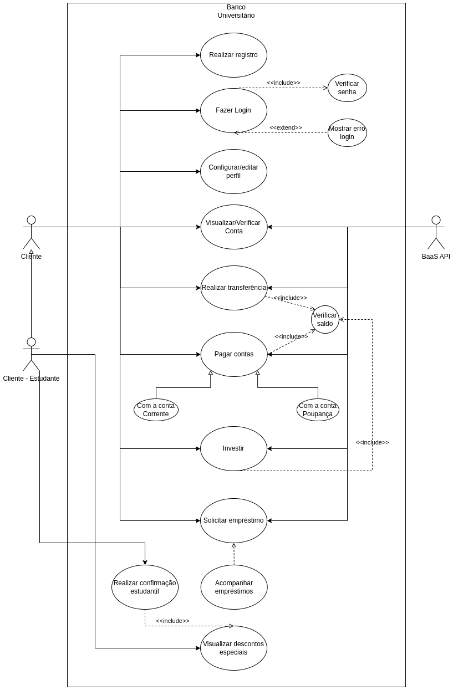

# 2 - Especificações do Projeto

Levantamos a necessidade da criação de um sistema que atendesse às demandas financeiras de estudantes e universitários. Os membros da equipe passaram alguns dias em estabelecimentos a fim de entender, através de observações e entrevistas, quais eram os problemas enfrentados no dia a dia de um estudante universitário no que diz respeito a sua vida financeira e seus desejos em conseguir descontos especiais em empresas e softwares diversos. 

## 2.1 - Personas

***

### **João Astolfindo**

**Idade**: 37

**Formação e ocupação**: Empresário no ramo de gastronomia há mais de 10 anos em busca de seguir o sonho de ser professor de Geografia.

**Objetivos**: João almeja se formar como Geógrafo e deseja realizar uma transição radical de carreira.

**Motivações**: Sua maior motivação é a paixão por viagens e lugares novos

**Medos**: Possui receio de não conseguir administrar e guardar dinheiro suficiente para a mudança de carreira de forma segura. 

**Hobbies**: Sua paixão por diferentes culturas o direcionaram a cursar Geografia.

***

### **Ana Carolina**

**Idade:** 24

**Formação e ocupação:** Estudante bolsista do terceiro ano de direito em uma excelente faculdade privada e revendedora de cosméticos.

**Objetivos:** Ana deseja se tornar uma advogada renomada e trabalhar em um grande escritório em São Paulo.

**Motivações:** Sua maior motivação é a família.

**Medos:** Possui receio de não  conseguir se manter até o término da faculdade.

**Hobbies:** Ama viajar e assistir séries criminais.

***

### **Julia Truliety**

**Idade:** 46

**Formação e ocupação:** Estudante de Pedagogia no período da noite e trabalha como empregada doméstica.

**Objetivos:** Julia deseja se tornar uma professora do jardim de infância.

**Motivações:** O seu grande alicerce é a família. Julia tem o sonho de visitar seu filho que está morando no Canadá há 2 anos.

**Medos:** Possui receio de não conseguir se manter até o término da faculdade.

**História e Hobbies:** Ama crianças e educação infantil.

***

### **Enzo Eduardo**

**Idade:** 19

**Formação e ocupação:** Estudante de Medicina em período integral

**Objetivos:** Enzo deseja se tornar um médico do programa Médicos sem Fronteiras.

**Motivações:** O seu grande sonho é se tornar médico. Ele também ama video games.

**Medos:** Possui receio de se manter dependente financeiramente até o término da faculdade.

**Hobbies:** Ama jogar online

***

## 2.2 - Histórias de Usuários

Com base na análise das personas forma identificadas as seguintes histórias de usuários:

|EU COMO... `PERSONA`| QUERO/PRECISO ... `FUNCIONALIDADE` |PARA ... `MOTIVO/VALOR`   |
|--------------------|------------------------------------|--------------------------|
|João Astolfindo| conseguir economizar com tarifas bancárias e ter acesso a descontos de estudantes| para guardar dinheiro para os livros do próximo semestre |
|João Astolfindo | Ter a visibilidade do saldo em conta e gastos realizados em tempo real| gerenciar meus rendimentos de forma eficiente|
|João Astolfindo | Ter a possibilidade de solicitar empréstimos | para ter maior segurança financeira no momento da transição de carreira.|
|João Astolfindo |Realizar pagamento de boleto|efetuar de forma simples o pagamento das suas principais contas de consumo|
|Ana Carolina|Visualizar de forma simples todos os lançamentos feitos em conta |gerenciar e manter registro das vendas de cosméticos.|
|Ana Carolina|Poder solicitar empréstimo a juros compatíveis com o mercado financeiro|para enfrentar os momentos mais complicados financeiramente.|
|Ana Carolina|Filtrar o histórico de transações nos  últimos 30 dias |para fazer o controle de todas as entradas e saídas no mês e fazer a programação de gastos para o próximo mês.|
|Ana Carolina|Fechar e visualizar os detalhes da conta|agilizar o tempo de finalização e pagamento do atendimento recebido.|
|Julia Truliety |Realizar transferências internacionais |enviar dinheiro para meu filho que mora no Canadá|
|Julia Truliety |Descontos em passagens áreas|para realizar o sonho de visitar seu filho no Canadá|
|Enzo Eduardo |Conseguir utilizar cartão de cŕedito online para compras de jogos pela internet |comprar pela internet de forma segura|
|Enzo Eduardo |Receber transferências bancárias de pessoas em outras contas e/ou bancos|para que sua mesada chegue até ele.|
## 2.3 - Requisitos

Com base nas Histórias de Usuário, enumeramos os requisitos da solução. Classificando esses requisitos em dois grupos:

- `Requisitos Funcionais
 (RF)`: correspondem a uma funcionalidade que deve estar presente na
  plataforma (ex: cadastro de usuário).
- `Requisitos Não Funcionais
  (RF)`: correspondem a uma característica técnica, seja de usabilidade,
  desempenho, confiabilidade, segurança ou outro (ex: suporte a
  dispositivos iOS e Android).

Lembrando que cada requisito deve corresponder à uma e somente uma
característica alvo da sua solução. Além disso, certifique-se de que
todos os aspectos capturados nas Histórias de Usuário foram cobertos.

As tabelas que se seguem apresentam os requisitos funcionais e não funcionais que detalham o escopo do projeto.

### 2.3.1 - Requisitos Funcionais

|ID    | Descrição do Requisito  | Prioridade |
|------|-----------------------------------------|----|
|RF-01|O sistema deve permitir que o usuário realize o cadastro.|Alta|
|RF-02| O sistema deve permitir ao usuário criar uma conta junto ao banco.|Alta| 
|RF-03| O sistema deve permitir ao usuário fazer transações bancárias essenciais.|Alta|
|RF-04| O sistema deve permitir o encerramento da conta.|Alta|
|RF-05|O sistema deve disponibilizar lista de descontos e suas respectivas empresas para os estudantes devidamente cadastrados no sistema.|Alta|
|RF-06| O sistema deve permitir ao usuário fazer transferência entre contas de bancos diferentes.|Média|
|RF-07| O sistema deve permitir a solicitação de empréstimo.|Baixa| 
|RF-08| O sistema deve permitir a solicitação de cartão de cŕedito.|Baixa|
|RF-09| O sistema deve permitir realizar pagamento de contas diversas por meio de boleto bancário ou PIX.|Média|
|RF-10|O sistema deve disponibilizar aplicativo e/ou site para o acesso dos usuários.|Alta|
|Esses estavam na parte de Requisitos n funcionais| \\/\\/\\/\\/|
|RF-11|	O sistema deve fornecer descrição de cada produto/desconto selecionado pelo usuário.|	Baixa|
|RF-12|  Os produtos/descontos devem ser separados por categorias.	|Média|
|RF-13|	Usuários sem confirmação de estudantes devem ter acesso a descontos diferentes aos de estudantes	|Alta|
|RF-14|	O sistema deve estar em conformidade com as regulamentações bancárias locais.	|Alta|
|RF-15|	O sistema deve gerar histórico de itens/descontos selecionados pelo usuário.	|Baixa|
|RF-16|	O sistema deve validar as transações e gerar recibos e comprovantes.	|Média|
|RF-17|	O sistema deve permitir recuperar senha através do E-mail ou Telefone celular.	|Baixa|

### 2.3.2 - Requisitos não Funcionais

|ID     | Descrição do Requisito  |Prioridade |
|-------|-------------------------|----|
|RNF-01| O sistema deverá ser Consistente e Padronizado por inteiro	|Alta|
|RNF-02| O sistema deve ser capaz de redirecionar o usuário para as páginas de desconto escolhidas em pelo menos 10 segundos.|Média|
|RNF-04| O sistema deve ser feito utilizando .NET Core em sua versão mais recente e estável	|Média|
|RNF-04| O software deve ser compatível com os principais browsers do mercado - Firefox, Chrome, Edge, Safari, Brave, etc.|Alta|
|RNF-05| O software deve ter um tempo de retorno para as consultas de até 10 segundos.|Média|
|RNF-06| O sistema deve ser capaz de rodar em diversos tamanhos de tela.|Alta|
|Esses estavam na parte de RESTRIÇÕES|\\/\\/\\/\\/\\/|
|RNF-00|	O sistema deve ficar on-line sempre (24 horas por dia e 7 dias por semana).	|Alta|
|RNF-00|	O sistema não deverá ter linguagens diferentes na parte da APIs.	|Média|
|RNF-00|	O sistema deve estar em conformidade com as políticas de segurança e privacidade da empresa e com as leis e regulamentos bancários aplicáveis.	|Alta|
|RNF-00|	O sistema deve ser acessível para todos os usuários, independentemente de suas habilidades e deficiências seguindo as diretrizes de acessibilidade da Web (WCAG).|	Média|
|RNF-00|	Por padrão, o sistema não deverá repassar informações para plataformas externas. Somente as autorizadas pelo usuário.	|Média|

## 2.4 - Restrições

O projeto está restrito pelos itens apresentados na tabela a seguir.

|ID| Restrição                                             |
|--|-------------------------------------------------------|
|01| O projeto deverá ser finalizado até o dia 19/06/2023|
|02| A equipe de desenvolvimento deve contar com 6 (seis) desenvolvedores|
|03| Deve haver ao menos 1 (uma) pessoa responsável pelo design do sistema|
|04| A equipe não pode trabalhar no projeto por mais de 4 (quatro) horas por dia|
|05| Deve haver pelo menos 1 (uma) reunião geral por semana, com duração de até 2 (duas) horas|
|06| 
## 2.5 - Diagrama de Casos de Uso

1. Registrar: Este caso de uso permite que um novo usuário se registre no sistema, criando uma nova conta de usuário com informações pessoais e bancárias.
2. Login: Este caso de uso permite que um usuário registrado faça login no sistema, autenticando-se com seu nome de usuário e senha.
3. Verificar conta: Este caso de uso permite que o usuário verifique sua conta bancária fornecendo as informações solicitadas pelo banco digital.
4. Realizar transferência: Este caso de uso permite que o usuário transfira dinheiro de uma conta bancária para outra conta bancária, dentro ou fora do banco digital.
5. Pagar contas: Este caso de uso permite que o usuário pague contas diretamente pelo aplicativo móvel ou pelo site do banco digital.
6. Solicitar empréstimo: Este caso de uso permite que o usuário solicite um empréstimo pessoal com taxas de juros competitivas diretamente pelo aplicativo móvel ou pelo site do banco digital.
7. Gerenciar empréstimos: Este caso de uso permite que o usuário gerencie seus empréstimos pessoais, incluindo visualização de saldo, pagamento de parcelas e solicitação de mudanças nos termos do empréstimo.
8. Investir dinheiro: Este caso de uso permite que o usuário invista em fundos de índice de baixo custo diretamente pelo aplicativo móvel ou pelo site do banco digital.
9. Programa de recompensas: Este caso de uso permite que o usuário participe de um programa de recompensas, com descontos em produtos e serviços relevantes para estudantes universitários, como livros e cursos online.
10. Configurações de perfil: Este caso de uso permite que o usuário atualize suas informações pessoais e preferências de comunicação.

 Casos de uso do projeto - feito com a ferramenta draw.io
