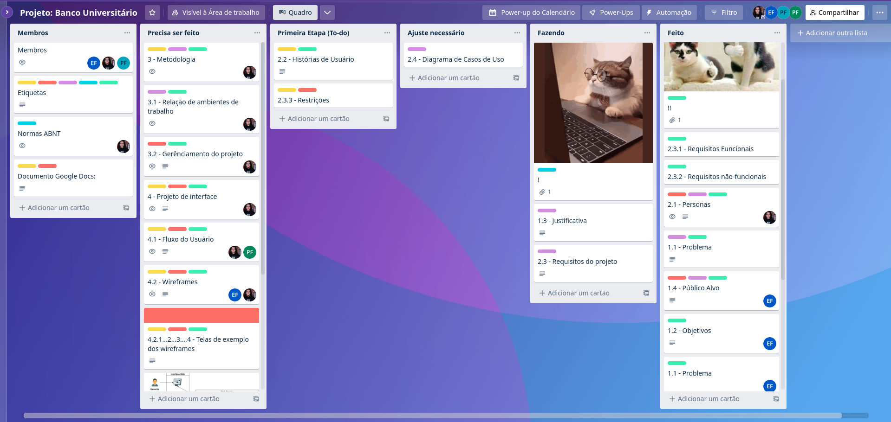

# 3 - Metodologia

A metodologia define as ferramentas utilizadas pela equipe. Inicialmente criamos projetos utilizando as seguintes ferramentas: Trello e Teams para gerenciamento do projeto; Github para servir de repositório e versionador de código fonte; Google Docs para edição do relatório de forma paralela e integrada com a equipe; MarvelApp para desenvolvimento do projeto de interfaces.

Posteriormente, identificamos as necessidades das personas e compilamos as histórias de usuários, através da observação e entrevistas in loco.

Cada usuário terá suas telas com as funcionalidades que lhes foram atribuídas, portanto, desenvolvemos o projeto das telas como, por exemplo: de login; cadastro/edição dos itens do cardápio; acompanhamento dos status dos pedidos; visualização do consumo por mesa, dentre outras.

As entregas serão separadas em sprint de 1 semana, em relação a cada requisitos funcional explicado na documentação, toda a estrutura estará no servidor da Microsoft Azure em questão de segurança dos dados.

A cada etapa de desenvolvimento serão realizados os testes funcionais do sistema, com a validação do cliente, conforme a documentação do escopo do projeto.

## 3.1 - Controle de Versão

A ferramenta de controle de versão adotada no projeto foi o
[Git](https://git-scm.com/), sendo que o [Github](https://github.com)
foi utilizado para hospedagem do repositório.

O projeto segue a seguinte convenção para o nome de branches:

- `main`: versão estável já testada do software
- `unstable`: versão já testada do software, porém instável
- `testing`: versão em testes do software
- `dev`: versão de desenvolvimento do software

Quanto à gerência de issues, o projeto adota a seguinte convenção para
etiquetas:

- `documentation`: melhorias ou acréscimos à documentação
- `bug`: uma funcionalidade encontra-se com problemas
- `enhancement`: uma funcionalidade precisa ser melhorada
- `feature`: uma nova funcionalidade precisa ser introduzida

> **Links Úteis**:
> - [Tutorial GitHub](https://guides.github.com/activities/hello-world/)
> - [Git e Github](https://www.youtube.com/playlist?list=PLHz_AreHm4dm7ZULPAmadvNhH6vk9oNZA)
>  - [Comparando fluxos de trabalho](https://www.atlassian.com/br/git/tutorials/comparing-workflows)
> - [Understanding the GitHub flow](https://guides.github.com/introduction/flow/)
> - [The gitflow workflow - in less than 5 mins](https://www.youtube.com/watch?v=1SXpE08hvGs)

## 3.2 - Gerenciamento de Projeto

### 3.2.1 - Divisão de Papéis

A equipe utiliza metodologias ágeis, tendo escolhido o Scrum como base para definição do processo de desenvolvimento. 

A equipe está organizada da seguinte maneira: 

- `Scrum Master`: Elísia Resende Valim Ferrari
- `Product Owner`: Geraldo Homero do Couto Neto
- `Equipe de Desenvolvimento`
    - Cláudio Lopes Coelho Barroso
    - Diana Santiago Oliveira dos Santos
    - Elísia Resende Valim Ferrari
    - Geraldo Homero do Couto Neto
    - Hugo César Candian Ferreira
    - Pedro Victor de Souza Fidelis
- `Equipe de Design`
    - Diana Santiago Oliveira dos Santos

### 3.3 - Processo

Para a organização da equipe e a distribuição de tarefas foi escolhido o Trello, que se encontra estruturado da seguinte maneira:

- `Para Fazer` - Representa o que precisa ser feito no momento;
- `Fazendo`  - O que está sendo feito e por qual membro da equipe está sendo feito;
- `Feito` - Lista com as tarefas realizadas;
- `Ajuste necessário` - Avaliação feita da lista “Feito” para alguns sprints que precisam ser revistos ou que apresentaram com algum erro durante o processo de revisão.

 Tela do ambiente Trello usado pelo grupo

### 3.4 - Ferramentas

As relações de trabalho serão desenvolvidas em home office, e as entregas serão feitas por sprint com a realização de cerimônias ágeis aos moldes do `Scrum`, um framework para gerência de software com ênfase primária no desenvolvimento de software. 

|Ambiente|Plataforma|Link de acesso|
|--------|----------|--------------|
|Editores de Código| VSCode e Visual Studio Community| https://code.visualstudio.com/ e https://visualstudio.microsoft.com/|
|Repositório|Github|https://github.com/ICEI-PUC-Minas-PMV-ADS/pmv-ads-2023-1-e2-proj-int-t04-g4-banco-universitario|
|Projeto de interface, wireframes e UML|MarvelApp e draw.io|https://marvelapp.com/prototype/71eh8dc|
|Gerenciamento do projeto|Trello e Teams| https://trello.com/b/DaT7e2zl/projeto-banco-universit%C3%A1rio |

O `VSCode` e o `Visual Studio Community` foram escolhidos porque eles possuem uma integração com o sistema de versão. As ferramentas de comunicação (`Trello` e `Teams`) utilizadas possuem integração semelhante e por isso foram selecionadas. Por fim, para criar diagramas utilizamos `draw.io` e `MarvelApp` por melhor captar as necessidades da nossa solução.

### Usando [draw.io](https://diagrams.net):
>
>Abra o site https://diagrams.net; ou faça download pelo [Link](https://github.com/jgraph/drawio-desktop/releases)
>
>Faça [Download](../docs/UML/) do nosso arquivo `.drawio`;
>
>Vá em `Start now` >>> `Abrir diagrama existente`

